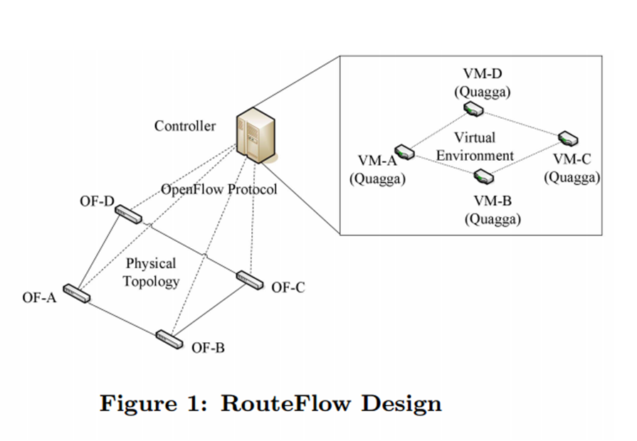
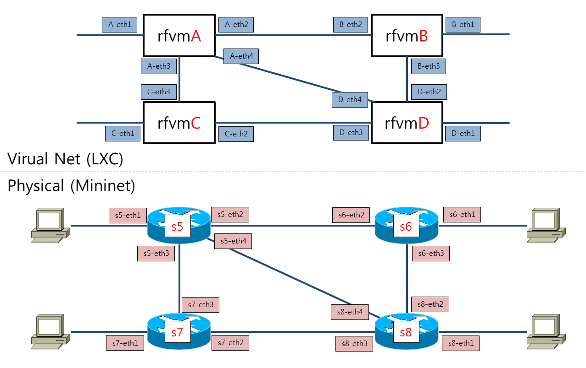
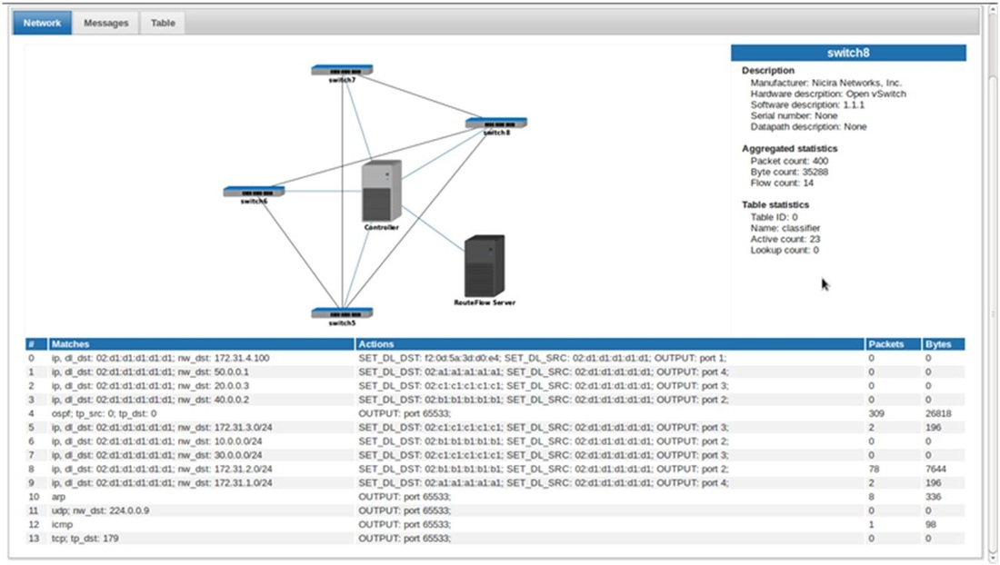
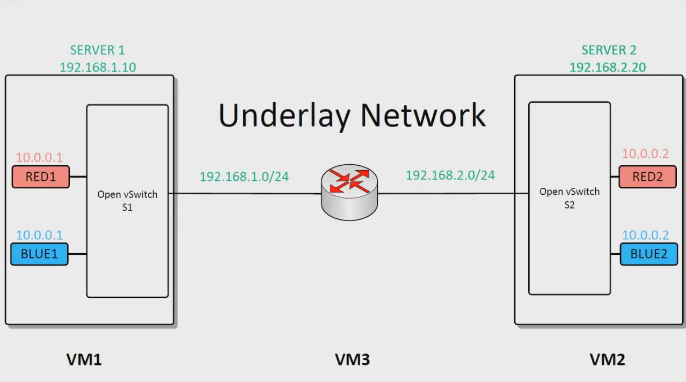
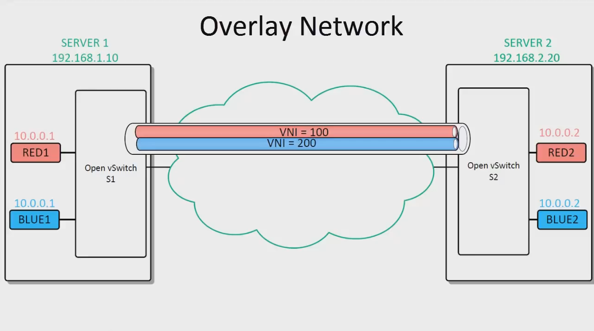

# Description

SDN Test Suite

# Intro

### Vagrant-based SDN Test Suite.

* OpenDaylight /w Mininet
* RouteFlow
* VXLAN /w OVS

### Vagrant VMs

* opendaylight-mininet

* routeflow

* devstack-control

* Devstack-compute-1

* devstack-compute-2

* devstack-compute-3

* vxlan-router

* vxlan-server1

* vxlan-server2

# OpenDaylight /w Mininet

SDN Controller, OpenDaylight TESTing with Mininet

### Sample OpenDaylight Helium Web-UI

### Start Vagrant

`host> vagrant up opendaylight-mininet`

### Components of VM

* OpenDaylight(Helium)
* Mininet 2.1.x
* Wireshark /w OF Plugin

### Run OpenDaylight (Helium Pre-Built Binary)

* Run OpenDaylight

      `host> vagrant ssh opendaylight-mininet`

      `vm> cd /home/vagrant/opendaylight-mininet`

      `vm> ./run-mininet.sh`

      `opendaylight-user@root> feature:install odl-dlux-core odl-restconf odl-nsf-all odl-adsal-northbound odl-mdsal-apidocs odl-l2switch-switch`

* Web-UI

      Browser: `http://{Vagrant Host IP}:8181/dlux/index.html`
      Default ID/PW: `admin / admin`

### Run Mininet

* Common Topology

      `host> vagrant ssh opendaylight-mininet`

      `vm> sudo mn --controller remote,ip=127.0.0.1,port=6633 --switch ovsk --topo tree,3`

* Custom Topologys

      `vm> cd /home/vagrant/topo-mininet`

# RouteFlow

RouteFlow, is an open source project to provide virtualized IP routing services over OpenFlow enabled hardware.

Home: https://sites.google.com/site/routeflow/home
Video: https://www.youtube.com/watch?v=YduxuBTyjEw

(Note) OpenFlow1.0 Based

### RouteFlow Design

### Start Vagrant

`host> vagrant up routeflow`

### Architecture of Tutorial-2 Demo

RouteFlow Document: https://sites.google.com/site/routeflow/documents/tutorial2-four-routers-with-ospf

### Components of VM

* RouteFlow
* OpenDaylight(Built Hydrogen) & RFProxy(for OpenDaylight)
* Mininet
* NOX(Default: Disabled)
  * `/home/vagrant/RouteFlow-Test/RouteFlow/rftest/rftest2`
* LXC Container (for Simulation Quagga's OSPF, BGP, RIP)

### Run OpenDaylight (Hydrogen)

* Run OpenDaylight

      `host> vagrant ssh routeflow`

      `vm> cd /home/vagrant/opendaylight`

      `vm> ./run.sh`

* Web-UI (OpenDaylight)

      Browser: `http://{Vagratn Host IP}:8080`
      Default ID/PW: `admin / admin`

### Run RouteFlow Tutorial-2

* Run RouteFlow

      `host> vagrant ssh routeflow`

      `vm> cd /home/vagrant/RouteFlow-Test/RouteFlow/rftest/`

      `vm> sudo ./rftest2`

* RouteFlow Web-UI

      `host> vagrant ssh routeflow`

      `vm> cd /home/vagrant/RouteFlow-Test/RouteFlow/rfweb`

      `vm> gunicorn -w 4 -b 0.0.0.0:8111 rfweb:application`

      Browser: `http://Vagrant Host IP}:8111/index.html`

### Run Mininet

* Run Mininet (Virtual Infra)

      `host> vagrant ssh routeflow`

      `vm> cd /home/vagrant/rf-topo-mininet/`

      `vm> sudo ./run-routeflow-infra.sh`

### RouteFlow Mapping Virtual-Router & Physical-Router

### RouteFlow APPENDIX

* Tutorial-1 (rftest1)
  * https://github.com/CPqD/RouteFlow/wiki/Tutorial-1:-rftest1
* Tutorial-2 (rftest2)
  * https://github.com/CPqD/RouteFlow/wiki/Tutorial-2:-rftest2
* RouteFlow Web-UI Sample

# DevStack /w OpenDaylight

* (Note) *Order is important!*
* DevStack (Icehouse)
  * Controller/Network Node: 1 Host
  * Compute Node: 1 Host (Max: 3)
* OpenDaylight (Helium)

### Start Vagrant

1. `host> vagrant up devstack-control`
2. `host> vagrant up devstack-compute-1`

### Run Control/Network Node

      `host> vagrant ssh devstack-control`

      `vm> cd /home/vagrant/devstack`

      `vm> ./stack.sh

      Browser: `http://{Vagratn Host IP}`

### Run Compute-1 Node (also Compute-2, Compute-3)

      `host> vagrant ssh devstack-compute-1`

      `vm> cd /home/vagrant/devstack`

      `vm> ./stack.sh

# VXLAN /w OVS

* Configuration of VXLAN tunnel ports in OVS
* Configuration of OpenFlow entries OVS
* Logical separation of traffic between tenants
* Ref. http://www.youtube.com/watch?v=tnSkHhsLqpM

### Start Vagrant

(Note) *Order is important!*

1. `host> vagrant up vxlan-router`

2. `host> vagrant up vxlan-server1`

3. `host> vagrant up vxlan-server2`

### Underlay

* Underlay: 192.168.1.0/24, 192.168.2.0/24

### Overlay

* Overlay: 10.0.0.0/24 per Tenant

### vxlan-router

* Router Role, between 192.168.1.0/24 and 192.168.2.0/24

### vxlan-server1

* IP: 192.168.1.10
* RED, BLUE Network's Underlay

### vxlan-server2

* IP: 192.168.2.20
* RED, BLUE Network's Underlay

# Refrences

https://github.com/opendaylight/ovsdb/blob/master/README.Vagrant
